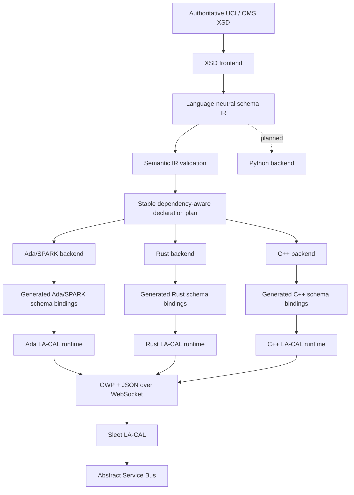

# Architecture

## 1. Architectural intent

`ams-gra-codegen-oms` is a compiler/tooling project that sits **above** the OMS LA-CAL runtime boundary. Its purpose is to remove repetitive, error-prone schema and protocol glue from application code without changing the externally visible OMS behavior of the mission system.

The repository deliberately separates four concerns:

1. **Authoritative schema input** — UCI/OMS XSD documents.
2. **Semantic normalization** — one language-neutral schema IR.
3. **Language generation** — Ada/SPARK, Rust, C++, and later Python backends.
4. **Runtime transport/protocol** — small handwritten language runtimes that speak the existing OWP/WebSocket/JSON interface to Sleet.

## 2. Before this project

The public AMS GRA Starter Kit presents LA-CAL as a language-agnostic interface. A service can open a WebSocket to Sleet, send an OWP `INIT`, send `SUB`/`PUB` operations, and encode/decode UCI JSON itself.

Conceptually:

```text
Application
   |
   | manually constructs/parses
   v
OWP strings + UCI JSON
   |
WebSocket
   |
Sleet / LA-CAL
   |
ASB
```

This is portable, but each language has to recreate:

- UCI type models;
- schema constraints;
- JSON field mapping;
- message metadata;
- OWP frame construction/parsing;
- publish/subscribe wrappers;
- schema-version handling.

The public Starter Kit documentation does not currently present a common multi-language generator that owns those tasks.

## 3. After this project



## 4. Runtime compatibility boundary

The code generator must preserve the existing observable LA-CAL contract.

### Unchanged

- Sleet remains the LA-CAL implementation used by the Starter Kit.
- WebSocket remains the language-agnostic transport exposed to clients.
- OWP remains the framing/operation protocol.
- JSON remains the UCI representation used on this interface.
- UCI remains the authoritative message model.
- CAL remains the application-facing abstraction boundary above the ASB.
- Service registration and allowed topic/message policy remain deployment concerns.
- Existing handwritten OWP clients remain valid.

### Added

- build-time schema parsing and normalization;
- generated language-native types;
- generated validation;
- generated JSON codecs/mappings;
- generated message descriptors/qualified names;
- typed publish/subscribe facades;
- reproducible generation manifests;
- optional schema compatibility/diff tooling.

No server-side Sleet change is required for the initial architecture.

## 5. Compiler pipeline

```text
          XSD documents
               |
               v
       +----------------+
       | loader         |
       | includes       |
       | imports        |
       +-------+--------+
               |
               v
       +----------------+
       | XSD parser     |
       | syntax model   |
       +-------+--------+
               |
               v
       +----------------+
       | name resolver  |
       | QName/ns graph |
       +-------+--------+
               |
               v
       +----------------+
       | normalizer     |
       | restrictions   |
       | inheritance    |
       | cardinality    |
       | choice/groups  |
       +-------+--------+
               |
               v
       +----------------+
       | OMS/UCI        |
       | classifier     |
       +-------+--------+
               |
               v
       +----------------+
       | IR validator   |
       +-------+--------+
               |
               v
       +----------------+
       | Schema IR      |
       +-------+--------+
               |
       +-------+---------+---------+
       |                 |         |
       v                 v         v
      Ada               Rust      C++
```

The frontend owns deterministic schema discovery and preserves declarations in
pre-order document discovery and source order. That IR order is reproducible,
but it is not promised to be directly compilable: a declaration may refer by
value to a declaration discovered later.

For closed abstract structural values, backends first perform their ordered
semantic validation and only then request the generated-entity emission plan.
This preserves the first unsupported semantic diagnostic: an unrelated later
empty abstract value wrapper cannot preempt an earlier value use. The Schema IR
dependency graph still records schema declarations and structural ancestry. The
generated by-value graph is separate: an abstract wrapper depends on each
concrete transitive descendant it stores, and a consumer depends on the wrapper;
a flattened concrete descendant does **not** depend on its abstract base merely
because it extends it.

These are three distinct concerns: the normalized Schema IR named-dependency
graph, the generated closed-value dependency graph, and backend coverage's
renderability classification. A generated-value cycle can therefore leave the
Schema IR valid while requiring indirection the current backends deliberately do
not provide. Generation fails closed if that wrapper is demanded; coverage
records it as unsupported and continues measuring the rest of the schema.

After complete IR assembly, the language-neutral validator checks namespace and
qualified-name coherence, references, cardinalities, constraints, and structural
invariants. `codegen-core` then computes one stable dependency-safe type plan.
Among currently dependency-satisfied declarations, it emits the declaration
with the lowest original Schema IR index next.
Ada, Rust, and C++ all consume that shared plan before applying their separate
backend capability policies. The planner has no XSD or language-specific
knowledge.

The crucial dependency direction is:

```text
backend -> IR
```

and never:

```text
backend -> raw XML/XSD DOM
```

If a backend needs to understand `xs:extension`, `xs:choice`, namespace prefixes, import paths, or anonymous XSD naming rules, the frontend/IR boundary is too weak.

The initial Ada, Rust, and C++ type backends enforce this boundary directly:

- backend crates depend only on the normalized IR and shared code-generation contract;
- language-specific identifier conversion is backend-local and never stored in the IR;
- generated representations may differ (constrained Ada types, checked Rust
  newtypes, and checked C++ wrappers) while preserving equivalent constraints;
- declaration and variant order follows the IR, making generated source
  byte-for-byte deterministic for the same input.

The executable is an orchestration shell around these components, not another
semantic layer. Its `validate` command loads a schema set and reports stable IR
counts. Its `generate` command loads and validates the schema, selects an
existing backend through the shared `Backend` trait, asks that backend for the
complete `Vec<GeneratedFile>`, validates every relative output path and checks
for duplicates, and only then creates directories and writes files. Parsing,
normalization, semantic validation, and dependency planning remain owned by the
frontend, IR, and code-generation crates.

Generated output paths must consist entirely of normal relative components;
absolute paths, platform prefixes, root components, and parent traversal are
rejected. This structural check does not rely on canonicalizing children that
do not yet exist. During writing, existing symbolic links beneath the selected
output root are rejected rather than traversed. The portable check is not
race-free against a malicious process concurrently replacing filesystem
entries. Filesystem writes are intentionally not transactional: no write occurs
before all in-memory pipeline and file-set checks succeed, but a later I/O
failure can leave earlier files from that write phase in place.

The XSD frontend exposes two loading modes. `load_schema_document` intentionally
loads exactly one standalone document and rejects `xs:include` or `xs:import`.
`load_schema_set` recursively resolves the supported include/import closure
before constructing the IR. Its private document parser retains each source's
namespace bindings and unresolved dependency edges; prefixes are resolved in
the document where each QName occurs and disappear at the IR boundary.

Schema-set dependencies are restricted to local filesystem `schemaLocation`
values resolved relative to the referring document. Canonical physical paths
provide private graph identity for deduplication and cycle detection; HTTP(S),
catalog lookup, and chameleon includes are unsupported. Observable declaration
order is deterministic pre-order depth-first document discovery in dependency
source order, followed by declaration source order within each document.
Namespace declarations use first-seen URI order under that traversal, with the
first-seen source prefix retained only as presentation metadata.

For the initial Ada slice, bounded repetition uses fixed-capacity storage plus
an explicitly constrained length. The optional string uses a discriminated
record containing `Ada.Strings.Unbounded.Unbounded_String` when present because
the fixture supplies no finite string length; this may allocate and is a known
boundary to revisit when the IR carries an applicable string bound.

## 6. Why normalize before generation

XSD is a serialization/schema language, not an ideal code-generation IR. The same semantic type can be expressed in multiple XSD forms. Language backends should not each re-interpret those forms.

Normalization provides one answer for:

- QName resolution;
- include/import closure;
- anonymous type identity;
- extension/restriction relationships;
- inherited fields;
- `minOccurs`/`maxOccurs`;
- `nillable` versus absent;
- enum and scalar restrictions;
- pattern/length/range facets;
- sequence/choice composition;
- top-level publishable message identification;
- stable ordering and identifiers.

This substantially reduces backend complexity and makes cross-language equivalence testable.

## 7. Generated code versus runtime code

### Generated code

Schema-specific and regenerated when UCI changes:

- types;
- enums;
- containers;
- validation;
- schema metadata;
- JSON mappings;
- typed topic/publish/subscribe helpers.

### Handwritten runtime

Protocol-specific and relatively stable:

- WebSocket lifecycle;
- OWP state machine;
- connection/init;
- subscription handles;
- message dispatch;
- error and reconnect behavior;
- TLS/authentication hooks.

This line is important because it keeps generated output deterministic and reviewable while allowing runtime code to be tested like normal infrastructure software.

## 8. Ada/SPARK architecture

The Ada backend should distinguish pure/schema-domain code from the external runtime boundary.

```text
+------------------------------------------+
| SPARK-friendly generated domain         |
|                                          |
| UCI types                                |
| constraints / predicates                 |
| deterministic validation                 |
| message metadata                         |
+----------------------+-------------------+
                       |
=======================|==================== trusted boundary
                       |
+----------------------v-------------------+
| Ada runtime                              |
| JSON codec glue where needed             |
| WebSocket / TLS                          |
| OWP connection state                     |
+----------------------+-------------------+
                       |
                     Sleet
```

Not every generated representation must be provable from day one. The backend should, however, avoid choices that unnecessarily prevent later SPARK use.

## 9. Cross-language equivalence

A schema generator is useful only if its language outputs agree semantically.

The test strategy should therefore include a canonical set of schema fixtures and JSON vectors:

```text
fixture.xsd
   |
   v
same Schema IR
   |
   +--> Ada generated code ----+
   +--> Rust generated code ---+--> identical accepted/rejected vectors
   +--> C++ generated code ----+
```

For every supported schema feature, test:

- valid minimum representation;
- valid maximum/boundary representation;
- missing required fields;
- out-of-range scalar values;
- invalid enum values;
- empty/nonempty bounded sequences;
- each `choice` branch;
- inherited/extended types;
- unknown fields according to the selected JSON policy.

## 10. Versioning model

The generator, IR, runtime, and UCI schema version independently.

Generated artifacts should record all four dimensions:

```text
generator_commit = ...
ir_version        = ...
backend_version   = ...
uci_schema        = 002.5.0
schema_digest     = sha256:...
runtime_api       = 1
```

This avoids ambiguous generated sources and makes CI reproduction possible.

## 11. Why the IR should not become a new standard

The IR is intentionally internal. Publishing it as a competing mission-system schema would create another compatibility surface and undermine the goal of keeping UCI authoritative.

It may be serialized for:

- debugging;
- golden tests;
- schema diffs;
- cache artifacts;
- generator reproducibility.

But it is not a wire format and is not an application-level IDL.

## 12. Binary semantic values are owned octet sequences

Task 025 lowers unconstrained `PrimitiveKind::Binary` as an owned sequence of
octets in each backend (Rust `Vec<u8>`, C++ `std::vector<std::uint8_t>`, Ada
`Interfaces.Unsigned_8`-element vector), never as a hexadecimal or base64
lexical string. Lexical encodings — hex, base64, JSON, XML, CAL wire framing —
belong to future codec layers that this generator does not yet produce; the
generated value model only carries semantic bytes.

## 13. Uninhabited values generate no storage

An abstract structural declaration with zero concrete structural descendants in
the supplied schema set has no *known* payload. Task 026 makes this a
first-class classification distinct from schema invalidity — a well-formed
schema may legitimately declare an abstract extension point that nothing extends
yet, and a later schema set that adds one concrete descendant reclassifies the
same declaration with no code change.

Task 028 splits this into two deliberately separate layers so that an objective
fact is never confused with a policy interpretation:

- `AbstractValueInhabitance::NoKnownConcreteDescendants` is the **objective**
  topology of the supplied schema set. It states only what was loaded, and makes
  no claim about what may legally exist. (It was previously named
  `Uninhabited`, which silently embedded a closed-world reading.)
- `AbstractValueSemantics::NoLegalPayload` is the **world-interpreted**
  conclusion, reached only when the caller has asserted
  `GenerationWorld::ClosedSchemaSet`. Under `OpenExtensions` the same topology
  yields `OpenUnrepresentable` instead.

The rest of this section describes `ClosedSchemaSet` behaviour; see Section 15.

The consequence for lowering is that an *optional* occurrence of an uninhabited
value has exactly one legal state: absence. Storage for it would be a field that
can only ever hold "nothing", so the generator elides it entirely — no struct
member, no component, no wrapper type, and no dependency edge. The Schema IR is
never mutated; elision is purely a projection applied at the codegen boundary,
so the IR remains a faithful record of the source schema.

This is deliberately the *narrowest* rule supported by evidence. Every other
occurrence of an uninhabited value still fails closed with a clear diagnostic,
because each would require inventing a representation for an impossible value:

- a positive-minimum occurrence *requires* an inhabitant that cannot exist;
- a repeated (`0..*`) occurrence would need a collection type whose element type
  is uninhabited, and no authoritative evidence yet says an always-empty
  collection is the intended meaning;
- a nillable occurrence demands an explicit nil-versus-absent distinction;
- an occurrence carrying local constraints cannot have them silently discarded;
- a Choice alternative or message payload is an effectively required position.

The single shared decision point is `field_storage_semantics`, returning
`EffectiveValueMember::Stored` or `::AbsentOnly`. All three backends and the
emission planner consult it rather than re-deriving elision independently, so
they cannot drift. The planner additionally verifies via
`ensure_zero_descendant_target_only_used_as_absent_only` that *every* reference
to a zero-descendant target across the whole schema is absent-only before
skipping its wrapper; any other use re-raises the original error.

Coverage analysis applies the same rule unconditionally, not gated behind a
hypothetical feature family: inhabitance is a property of the schema itself, and
gating it would let enabling a feature *reduce* measured coverage.

## 14. Schema-set closure is not type-universe closure

Section 13's phrase "the current closed schema set" names *one* of two distinct
closures, and Task 027 separates them because conflating them is exactly how an
unsound assumption would enter the generator.

**Schema-set closure** is a property of a generation invocation: the finite,
deterministic set of XSD files reachable from the supplied root through
`xs:include`/`xs:import`. This generator always has it, and it is what makes
generation reproducible.

**Type-universe closure** is a much stronger semantic claim: that no legal value
of any declared type can ever have a runtime type outside that file set. XSD
does not grant this. Derivation by extension is open by default, and an instance
document may select an externally declared derived type via `xsi:type` at any
element whose declared type is not `final`/`block`-restricted.

Task 027 measured the pinned UCI 2.5/2.6 roots and found schema-set closure
holds while type-universe closure does not: the zero-descendant abstract types
are documented as extension points whose concrete forms are deliberately
supplied outside the open schema, and neither root ever uses `block` or `final`
to close them. See `docs/task-027-open-extension-points.md`.

The consequence for Section 13 is a scoping statement, not a correction: the
uninhabitance rule is valid under an assumed **closed type universe**. Task 028
turns that assumption into a declared, language-neutral policy; see Section 15.

## 15. Generation world

Because schema-set closure does not imply type-universe closure (Section 14),
and because the schema carries no machine-readable discriminator that would let
the generator tell an open extension point from an ordinary abstract type, the
generator does not decide the question at all. The **caller** states it, through
one language-neutral policy in `codegen-core`:

```text
GenerationWorld::ClosedSchemaSet
GenerationWorld::OpenExtensions
```

`ClosedSchemaSet` means: the caller asserts that the supplied `SchemaIr`
contains every concrete type that may legally inhabit an abstract value.
`OpenExtensions` means: additional concrete derived types may exist outside it.

This is a **generator policy, not source-schema semantics**. It is never stored
in `SchemaIr`, and it is never inferred — not from the absence of imports, not
from namespace count, not from `uci:version`, not from type names, and not from
documentation text. Task 027 demonstrated that none of those is a reliable
discriminator. Loading a complete, self-consistent schema set does not prove
`ClosedSchemaSet`; only the caller can assert it.

The policy is language-neutral by construction. Ada, Rust, and C++ share the one
enum and must not define their own; a per-backend world would let the three
languages disagree about which values exist, which is a semantic question, not a
rendering question.

### How the world affects each stage

- **Abstract-value projection.** `abstract_value_projection_for_ref` takes the
  world. Closed-world behaviour is exactly Task 024. Open-world, *every*
  abstract structural value reference is rejected with
  `NotClosedUnderOpenExtensions`, regardless of whether the target has zero,
  one, or many known descendants — a known descendant set is never assumed
  exhaustive.
- **Task 024 closed sums.** Emitted only under `ClosedSchemaSet`. Descendant
  ordering, concrete non-leaf inclusion, abstract intermediate exclusion,
  emission order, and the recursive fail-closed boundary are unchanged.
- **Task 026 optional elision.** Applies only under `ClosedSchemaSet`. Under
  `OpenExtensions`, `field_storage_semantics` never returns `AbsentOnly` merely
  because a target has zero known descendants: an external derived type may
  legally make the field present, so eliding its storage would silently lose
  data. Task 028 did **not** extend elision to repeated always-empty
  collections in either world.
- **Emission planning.** `plan_type_emissions(schema, world)` is defensive: if
  an abstract value target is actually demanded under `OpenExtensions` it fails
  rather than constructing a closed wrapper, even though backend validation
  normally rejects first.
- **Coverage.** `CoverageAnalysis::new(schema, world)` stores the world once and
  computes every policy-dependent index once, so measurement stays linear.
  Under `OpenExtensions` no target is fully elided and no closed sum is baseline
  capability, so fully-renderable declarations and message closures drop; the
  `StructuralInheritanceAndAbstract` family still models the *hypothetical*
  future capability, which in the open world explicitly means runtime
  polymorphism that no backend implements. Coverage reports name the world that
  produced them.
- **Diagnostics.** The open-world rejection names the target and the policy,
  does not claim the schema is invalid, and suggests no placeholder. It is
  deterministic and identical across all three backends.

### What the world does *not* affect

Abstract declarations used only as inheritance ancestry are untouched: a
concrete type extending an abstract base still has a known effective field
layout, so Task 018 record flattening applies identically in both worlds. Only
abstract **value** positions are policy-sensitive. A schema with no abstract
value reference generates byte-identical output under either world.

Selecting `OpenExtensions` therefore never unlocks more generation than
`ClosedSchemaSet`; it is strictly more conservative. It exists so the generator
can be honest about an assumption it cannot verify, and so that a future
runtime-polymorphic representation has an explicit place to attach. Today, the
supported route to generating a real extension point is to supply the private
derived-type schema in the generation schema set (same target namespace) and
assert `ClosedSchemaSet`. Section 16 describes how that private schema is
supplied without editing the authoritative root.

## 16. Schema-set overlays

Section 15's supported route needs a way to add a private same-namespace schema
to a *pinned* authoritative root. Editing the root is unacceptable — it is the
reproducibility anchor — and manufacturing a wrapper document full of new
`xs:include` directives just to reach the private file is ceremony that obscures
provenance. Task 029 therefore makes the composition an explicit **input**:

```text
ams-gra-codegen-oms generate \
  --schema public-root.xsd \
  --overlay private-a.xsd \
  --overlay private-b.xsd \
  --language rust --output generated --world closed-schema
```

The frontend exposes one loading path,
`load_schema_set_with_overlays(root, overlays)`; `load_schema_set(root)` is now
simply its empty-overlay case, so existing callers are unaffected.

### Composition pipeline

```text
primary root
  + primary dependency closure
  + overlay A dependency closure
  + overlay B dependency closure
  -> one normalized SchemaIr
```

- **Primary closure first.** The root and its whole `xs:include`/`xs:import`
  closure are loaded before any overlay, which is what preserves primary
  declaration order, message order, namespace presentation, root schema version,
  and every existing diagnostic.
- **Overlay CLI order preserved.** Overlays are processed in caller-provided
  order and are never sorted. Filesystem-path sorting would make declaration and
  closed-sum variant ordering depend on where the files happen to live; the
  command line is explicit, portable input, so it is the ordering source.
  Reversing `--overlay` order deterministically reverses the resulting overlay
  declaration order, and that is documented behaviour rather than instability.
- **Canonical file dedupe.** The loader's existing canonical-path identity
  tracking is reused, so a document is parsed exactly once no matter how many
  input routes reach it — listed twice, listed while also reachable from the
  root, or spelled differently. One ordinary parse per unique document.
- **Top-level overlay namespace must match the root.** This is checked through a
  dedicated `NamespaceExpectation::Overlay` expectation so the diagnostic names
  the overlay, rather than blaming an `xs:include` the caller never wrote. Once
  an overlay root is accepted, its own dependencies use the ordinary loader
  rules — they are not reinterpreted as overlays, and remote `schemaLocation`
  stays rejected. An accepted overlay may still import other namespaces exactly
  as the root could, but the language backends remain single-namespace, so
  cross-namespace generation is still unsupported.
- **Root schema version remains authoritative.** `SchemaIr.schema_version` comes
  from the primary root. Overlay `version` attributes are validated as ordinary
  document metadata and discarded.

### Semantics

Overlays are **additive**. They may declare new types and messages, and may
derive from declarations in the root or in an earlier overlay, because named
references are resolved only after every document has been assembled —
resolution never special-cases whether a declaration arrived from the root or an
overlay. They may **not** replace, override, mutate, or remove a declaration:
a duplicate qualified name fails existing validation, with no precedence and no
shadowing.

Overlays are **build-time input composition only**. `SchemaIr` gains no overlay,
root, or private metadata; after loading it is the same normalized semantic
declaration set, and composition provenance remains visible through each
declaration's existing `SourceRef`. Overlay declarations participate in ordinary
Task 024 topology analysis rather than through any special path, which is why
supplying a private descendant removes its base from the zero-known-descendant
inventory.

Overlays are also **world-neutral**. Supplying one never selects
`ClosedSchemaSet` and never relaxes `OpenExtensions`: under `OpenExtensions` a
schema set containing some private descendants still treats abstract-value
descendant sets as non-exhaustive. This is emphatically not a runtime extension
registry; no runtime type registration, unknown-subtype representation, or
`xsi:type` dispatch exists.
