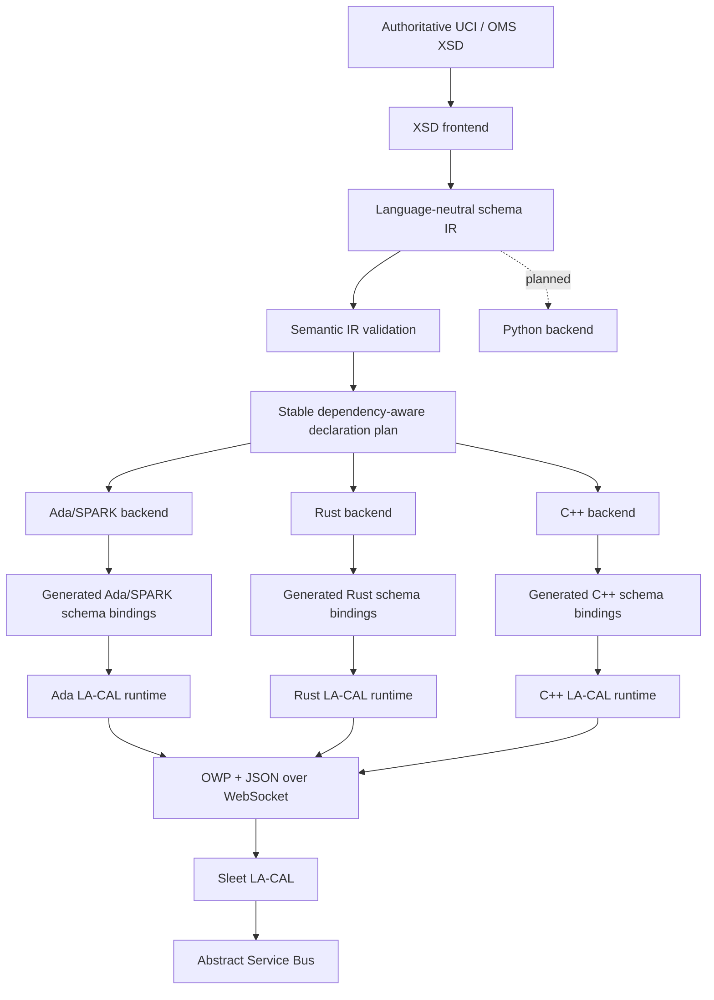

# Architecture

## 1. Architectural intent

`ams-gra-codegen-oms` is a compiler/tooling project that sits **above** the OMS LA-CAL runtime boundary. Its purpose is to remove repetitive, error-prone schema and protocol glue from application code without changing the externally visible OMS behavior of the mission system.

The repository deliberately separates four concerns:

1. **Authoritative schema input** — UCI/OMS XSD documents.
2. **Semantic normalization** — one language-neutral schema IR.
3. **Language generation** — Ada/SPARK, Rust, C++, and later Python backends.
4. **Runtime transport/protocol** — small handwritten language runtimes that speak the existing OWP/WebSocket/JSON interface to Sleet.

## 2. Before this project

The public AMS GRA Starter Kit presents LA-CAL as a language-agnostic interface. A service can open a WebSocket to Sleet, send an OWP `INIT`, send `SUB`/`PUB` operations, and encode/decode UCI JSON itself.

Conceptually:

```text
Application
   |
   | manually constructs/parses
   v
OWP strings + UCI JSON
   |
WebSocket
   |
Sleet / LA-CAL
   |
ASB
```

This is portable, but each language has to recreate:

- UCI type models;
- schema constraints;
- JSON field mapping;
- message metadata;
- OWP frame construction/parsing;
- publish/subscribe wrappers;
- schema-version handling.

The public Starter Kit documentation does not currently present a common multi-language generator that owns those tasks.

## 3. After this project



## 4. Runtime compatibility boundary

The code generator must preserve the existing observable LA-CAL contract.

### Unchanged

- Sleet remains the LA-CAL implementation used by the Starter Kit.
- WebSocket remains the language-agnostic transport exposed to clients.
- OWP remains the framing/operation protocol.
- JSON remains the UCI representation used on this interface.
- UCI remains the authoritative message model.
- CAL remains the application-facing abstraction boundary above the ASB.
- Service registration and allowed topic/message policy remain deployment concerns.
- Existing handwritten OWP clients remain valid.

### Added

- build-time schema parsing and normalization;
- generated language-native types;
- generated validation;
- generated JSON codecs/mappings;
- generated message descriptors/qualified names;
- typed publish/subscribe facades;
- reproducible generation manifests;
- optional schema compatibility/diff tooling.

No server-side Sleet change is required for the initial architecture.

## 5. Compiler pipeline

```text
          XSD documents
               |
               v
       +----------------+
       | loader         |
       | includes       |
       | imports        |
       +-------+--------+
               |
               v
       +----------------+
       | XSD parser     |
       | syntax model   |
       +-------+--------+
               |
               v
       +----------------+
       | name resolver  |
       | QName/ns graph |
       +-------+--------+
               |
               v
       +----------------+
       | normalizer     |
       | restrictions   |
       | inheritance    |
       | cardinality    |
       | choice/groups  |
       +-------+--------+
               |
               v
       +----------------+
       | OMS/UCI        |
       | classifier     |
       +-------+--------+
               |
               v
       +----------------+
       | IR validator   |
       +-------+--------+
               |
               v
       +----------------+
       | Schema IR      |
       +-------+--------+
               |
       +-------+---------+---------+
       |                 |         |
       v                 v         v
      Ada               Rust      C++
```

The frontend owns deterministic schema discovery and preserves declarations in
pre-order document discovery and source order. That IR order is reproducible,
but it is not promised to be directly compilable: a declaration may refer by
value to a declaration discovered later.

After complete IR assembly, the language-neutral validator checks namespace and
qualified-name coherence, references, cardinalities, constraints, and structural
invariants. `codegen-core` then computes one stable dependency-safe type plan.
Among currently dependency-satisfied declarations, it emits the declaration
with the lowest original Schema IR index next.
Ada, Rust, and C++ all consume that shared plan before applying their separate
backend capability policies. The planner has no XSD or language-specific
knowledge.

The crucial dependency direction is:

```text
backend -> IR
```

and never:

```text
backend -> raw XML/XSD DOM
```

If a backend needs to understand `xs:extension`, `xs:choice`, namespace prefixes, import paths, or anonymous XSD naming rules, the frontend/IR boundary is too weak.

The initial Ada, Rust, and C++ type backends enforce this boundary directly:

- backend crates depend only on the normalized IR and shared code-generation contract;
- language-specific identifier conversion is backend-local and never stored in the IR;
- generated representations may differ (constrained Ada types, checked Rust
  newtypes, and checked C++ wrappers) while preserving equivalent constraints;
- declaration and variant order follows the IR, making generated source
  byte-for-byte deterministic for the same input.

The executable is an orchestration shell around these components, not another
semantic layer. Its `validate` command loads a schema set and reports stable IR
counts. Its `generate` command loads and validates the schema, selects an
existing backend through the shared `Backend` trait, asks that backend for the
complete `Vec<GeneratedFile>`, validates every relative output path and checks
for duplicates, and only then creates directories and writes files. Parsing,
normalization, semantic validation, and dependency planning remain owned by the
frontend, IR, and code-generation crates.

Generated output paths must consist entirely of normal relative components;
absolute paths, platform prefixes, root components, and parent traversal are
rejected. This structural check does not rely on canonicalizing children that
do not yet exist. During writing, existing symbolic links beneath the selected
output root are rejected rather than traversed. The portable check is not
race-free against a malicious process concurrently replacing filesystem
entries. Filesystem writes are intentionally not transactional: no write occurs
before all in-memory pipeline and file-set checks succeed, but a later I/O
failure can leave earlier files from that write phase in place.

The XSD frontend exposes two loading modes. `load_schema_document` intentionally
loads exactly one standalone document and rejects `xs:include` or `xs:import`.
`load_schema_set` recursively resolves the supported include/import closure
before constructing the IR. Its private document parser retains each source's
namespace bindings and unresolved dependency edges; prefixes are resolved in
the document where each QName occurs and disappear at the IR boundary.

Schema-set dependencies are restricted to local filesystem `schemaLocation`
values resolved relative to the referring document. Canonical physical paths
provide private graph identity for deduplication and cycle detection; HTTP(S),
catalog lookup, and chameleon includes are unsupported. Observable declaration
order is deterministic pre-order depth-first document discovery in dependency
source order, followed by declaration source order within each document.
Namespace declarations use first-seen URI order under that traversal, with the
first-seen source prefix retained only as presentation metadata.

For the initial Ada slice, bounded repetition uses fixed-capacity storage plus
an explicitly constrained length. The optional string uses a discriminated
record containing `Ada.Strings.Unbounded.Unbounded_String` when present because
the fixture supplies no finite string length; this may allocate and is a known
boundary to revisit when the IR carries an applicable string bound.

## 6. Why normalize before generation

XSD is a serialization/schema language, not an ideal code-generation IR. The same semantic type can be expressed in multiple XSD forms. Language backends should not each re-interpret those forms.

Normalization provides one answer for:

- QName resolution;
- include/import closure;
- anonymous type identity;
- extension/restriction relationships;
- inherited fields;
- `minOccurs`/`maxOccurs`;
- `nillable` versus absent;
- enum and scalar restrictions;
- pattern/length/range facets;
- sequence/choice composition;
- top-level publishable message identification;
- stable ordering and identifiers.

This substantially reduces backend complexity and makes cross-language equivalence testable.

## 7. Generated code versus runtime code

### Generated code

Schema-specific and regenerated when UCI changes:

- types;
- enums;
- containers;
- validation;
- schema metadata;
- JSON mappings;
- typed topic/publish/subscribe helpers.

### Handwritten runtime

Protocol-specific and relatively stable:

- WebSocket lifecycle;
- OWP state machine;
- connection/init;
- subscription handles;
- message dispatch;
- error and reconnect behavior;
- TLS/authentication hooks.

This line is important because it keeps generated output deterministic and reviewable while allowing runtime code to be tested like normal infrastructure software.

## 8. Ada/SPARK architecture

The Ada backend should distinguish pure/schema-domain code from the external runtime boundary.

```text
+------------------------------------------+
| SPARK-friendly generated domain         |
|                                          |
| UCI types                                |
| constraints / predicates                 |
| deterministic validation                 |
| message metadata                         |
+----------------------+-------------------+
                       |
=======================|==================== trusted boundary
                       |
+----------------------v-------------------+
| Ada runtime                              |
| JSON codec glue where needed             |
| WebSocket / TLS                          |
| OWP connection state                     |
+----------------------+-------------------+
                       |
                     Sleet
```

Not every generated representation must be provable from day one. The backend should, however, avoid choices that unnecessarily prevent later SPARK use.

## 9. Cross-language equivalence

A schema generator is useful only if its language outputs agree semantically.

The test strategy should therefore include a canonical set of schema fixtures and JSON vectors:

```text
fixture.xsd
   |
   v
same Schema IR
   |
   +--> Ada generated code ----+
   +--> Rust generated code ---+--> identical accepted/rejected vectors
   +--> C++ generated code ----+
```

For every supported schema feature, test:

- valid minimum representation;
- valid maximum/boundary representation;
- missing required fields;
- out-of-range scalar values;
- invalid enum values;
- empty/nonempty bounded sequences;
- each `choice` branch;
- inherited/extended types;
- unknown fields according to the selected JSON policy.

## 10. Versioning model

The generator, IR, runtime, and UCI schema version independently.

Generated artifacts should record all four dimensions:

```text
generator_commit = ...
ir_version        = ...
backend_version   = ...
uci_schema        = 002.5.0
schema_digest     = sha256:...
runtime_api       = 1
```

This avoids ambiguous generated sources and makes CI reproduction possible.

## 11. Why the IR should not become a new standard

The IR is intentionally internal. Publishing it as a competing mission-system schema would create another compatibility surface and undermine the goal of keeping UCI authoritative.

It may be serialized for:

- debugging;
- golden tests;
- schema diffs;
- cache artifacts;
- generator reproducibility.

But it is not a wire format and is not an application-level IDL.
